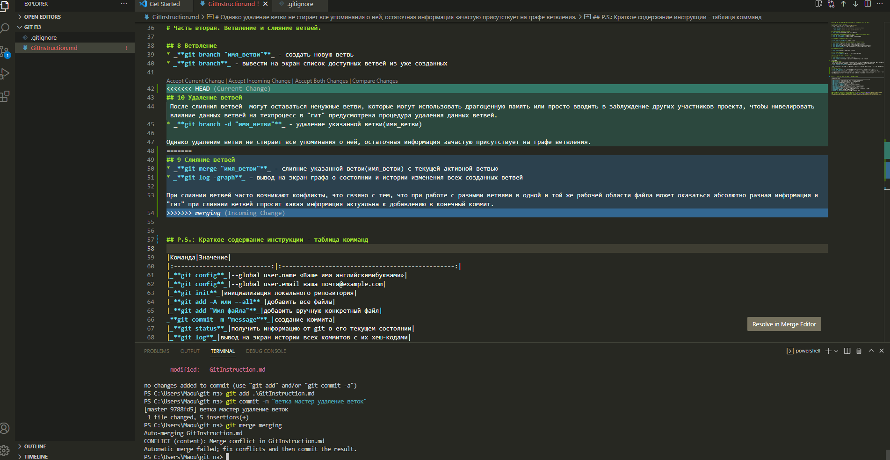

# Часть первая. Инструкция по базовым командам инструмента контроля версий "Git".

## 1. Установить и настроить Git.
* приложение доступно по [ссылке](https://git-scm.com/)
* Для авторизации следует ввести перед запуском:

   >_**git config**_ --global user.name «Ваше имя английскими буквами»

   >_**git config**_ --global user.email ваша почта@example.com

## 2. Инициализация файлового хранилища
* _**git init**_ – инициализация локального репозитория

## 3. Добавление отдельных файлов или всех файлов в область подготовленных файлов
* _**git add –A или –-all**_ - добавить все файлы
* _**git add  "Имя файла"**_ - добавить вручную конкретный файл

## 4. Создание коммита(фиксированной точки)

* _**git commit -m “message”**_ – создание коммита.

## 5. Положение и перемещение между коммитами(фиксированными точками)

* _**git status**_ - получить информацию от git о его текущем состоянии
* _**git log**_ – вывод на экран истории всех коммитов с их хеш-кодами
* _**git checkout "имя_коммита/ветви"**_ - переход от одного коммита к другому, перемещение между ветвями
* _**git checkout master**_ – вернуться к актуальному состоянию и продолжить работу

## 6. Сравнение коммитов

* _**git diff**_ – увидеть разницу между коммитами

## 7. Переименование файлов
* _**git mv "имя файла"**_ - переместить или переименовать файл

# Часть вторая. Ветвление и слияние ветвей.

## 8. Ветвление
* _**git branch "имя_ветви"**_ - создать новую ветвь
* _**git branch**_ - вывести на экран список доступных ветвей из уже созданных

## 9. Слияние ветвей
* _**git merge "имя_ветви"**_ - слияние указанной ветви(имя_ветви) с текущей активной ветвью
* _**git log -graph**_ – вывод на экран графа о состоянии и истории изменения всех созданных ветвей

При слиянии ветвей часто возникают конфликты, это свзяно с тем, что при работе с разными ветвями в одной и той же рабочей области файла может оказаться абсолютно разная информация и "гит" при слиянии ветвей спросит какая информация актуальна к добавлению в конечный коммит.
Например:

## 10. Удаление ветвей
 После слияния ветвей  могут оставаться ненужные ветви, которые могут использовать драгоценную память или просто вводить в заблуждение других участников проекта, чтобы нивелировать влияние данных ветвей на техпроцесс в "гит" предусмотрена процедура удаления данных ветвей.
* _**git branch -d "имя_ветви"**_ - удаление указанной ветви(имя_ветви) 

Однако удаление ветви не стирает все упоминания о ней, остаточная информация зачастую присутствует на графе ветвления.

# Часть третья. Удалённое хранилище.
## 11. Клонирование удалённого репозитория
*  _**git clone <url-адрес репозитория>**_ - позволяет склонировать внешний репозиторий на наш ПК

## 12. Обмен изменениями между локальной и удалённой версиями файла

* _**git push**_ -  позволяет отправить нашу версию репозитория на внешний
репозиторий. ТРЕБУЕТ АВТОРИЗАЦИИ на внешнем репозитории 
* _**git pull**_ позволяет скачать все из текущего репозитория и автоматически
сделать merge с нашей версией

## 13.Как сделать pull request
* Делаем fork репозитория
* Делаем clone СВОЕЙ версии репозитория
* Создаем новую ветку и в НЕЕ вносим свои изменения
* Фиксируем изменения (делаем коммиты)
* Отправляем свою версию в свой GitHub
* На сайте GitHub нажимаем кнопку pull request 

## P.S.: Краткое содержание инструкции - таблица комманд

|Команда|Значение|
|:---------------------------:|:------------------------------------------------:|
|_**git config**_|--global user.name «Ваше имя английскимибуквами»|
|_**git config**_|--global user.email ваша почта@example.com|
|_**git init**_|инициализация локального репозитория|
|_**git add –A или –-all**_|добавить все файлы|
|_**git add "Имя файла"**_|добавить вручную конкретный файл|
|_**git commit -m “message”**_|создание коммита|
|_**git status**_|получить информацию от git о его текущем состоянии|
|_**git log**_|вывод на экран истории всех коммитов с их хеш-кодами|
|_**git checkout "имя_коммита/ветви"**_|переход от одного коммита к другому, перемещение между ветвями|
|_**git checkout master**_|вернуться к актуальному состоянию и продолжить работу|
|_**git diff**_|увидеть разницу между коммитами|
|_**git mv "имя файла"**_|переместить или переименовать файл|
|_**git branch "имя_ветви"**_|создать новую ветвь|
|_**git branch**_|вывести на экран список доступных ветвей из уже созданных|
|_**git merge "имя_ветви"**_|слияние указанной ветви(имя_ветви) с текущей активной ветвью|
|_**git log -graph**_|вывод на экран графа о состоянии и истории изменения всех созданных ветвей|
|_**git branch -d "имя_ветви"**_|удаление указанной ветви(имя_ветви)
|_**git clone <url-адрес репозитория>**_|позволяет склонировать внешний репозиторий на наш ПК|
|_**git push**_|позволяет отправить нашу версию репозитория на внешний|
|_**git pull**_|позволяет скачать все из текущего репозитория и автоматически
сделать merge с нашей версией|
### Для написания данной инструкции был применён язык разметки Markdown 
### Руководство по синтаксису языка Markdown взято [электронного ресурса](https://texterra.ru/blog/ischerpyvayushchaya-shpargalka-po-sintaksisu-razmetki-markdown-na-zametku-avtoram-veb-razrabotchikam.html).

Всем спасибо!
